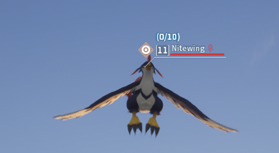

# Description
A visible pal capture counter mod which shows next to the pals' nickname how many times it has already been captured.

# Requirements
This mod utilizes [UE4SS xinput](https://github.com/UE4SS-RE/RE-UE4SS/releases) and has only been tested on the Singleplayer and Multiplayer Steam version of
Palworld.

# Installation
This installation guide is a copy of [this mod](https://www.nexusmods.com/palworld/mods/11)

### Steam
- Download the zip and extract it in ``Palworld\Pal\Binaries\Win64\Mods``.
- Add the following line to the mods.txt file in the ``Palworld\Pal\Binaries\Win64\Mods directory``.

**VisiblePalCaptureCounter : 1**

### Gamepass
Thanks to users Crazyon69 and AirborneMuffins for finding this solution and sharing it in the comments section of the Remove flying stamina cost mod.

- Download the zip and extract it in ``C:\Users\"UserName"\AppData\Local\Pal\Saved\Config\WinGDK\Mods``.
Alternatively, some users are reporting the mod should be installed in the following location: ``C:\XboxGames\Palworld\Content\Pal\Binaries\WinGDK\``
- Add the following line to the mods.txt file in the ``C:\Users\"UserName"\AppData\Local\Pal\Saved\Config\WinGDK\Mods directory``.
**VisiblePalCaptureCounter : 1**

If you get stuck, this video may help [Modding Palworld | Game Pass Guide | Install, Config & Use Mods in Palworld Game Pass](https://www.youtube.com/watch?v=znqukVJKpqQ).

## UE4SS xinput installation steps
### Steam
- Download **UE4SS_Xinput_v2.5.2.zip**
- Extract to ``Palworld\Pal\Binaries\Win64``
- Delete everything from the mods folder except for the mods.txt (optional)
- Open up the ``mods.txt`` and remove everything (optional, only if you removed the mods in the step above

### Gamepass
Thanks to users Crazyon69 and AirborneMuffins for finding this solution and sharing it in the comments section of the Remove flying stamina cost mod.

- Download **UE4SS_Xinput_v2.5.2.zip**
- Extract to ``C:\Users\"UserName"\AppData\Local\Pal\Saved\Config\WinGDK\``
Alternatively, some users are reporting UE4SS should be installed in the following location: ``C:\XboxGames\Palworld\Content\Pal\Binaries\WinGDK\``
- Rename xinput1_3 to xinput1_4
- In the UE4SS-settings.ini file, set bUseUObjectArrayCache to false.
- Delete everything from the mods folder except for the mods.txt (optional)
- Open up the ``mods.txt`` and remove everything (optional, only if you removed the mods in the step above

## Troubleshooting
If you are experiencing crashes, users Crazyon69 and sammaeru have posted a solution in the comments section of the Remove flying stamina cost mod.

- In the UE4SS-settings.ini file, set bUseUObjectArrayCache to false.

- If the mod doesn't seem to be loading, try these steps:

In the UE4SS-settings.ini file, scroll down to the [Debug] heading and
enable the consoles by changing their values from '0' to '1'
- Boot the game and check that the mod is correct loading in the console,
towards the end it should say something like "Starting Lua mod 'modName" (modName is a placeholder, it should be the name of the folder)
- If the console isn't opening at all, try renaming the xinput file back to xinput1_3

For Steam users - if you have tried both of the above, watch the ['How To EASILY Install Mods - Palworld' video](https://www.nexusmods.com/palworld/mods/11?tab=videos) and make sure everything is correct.

# Multiplayer
The mod is client side and it also works in multiplayer

# Lag?
You can try:

1. Open UE4SS-settings.ini:

    ``...\Pal\Binaries\Win64\UE4SS-settings.ini``

2. Set ``bUseUObjectArrayCache`` to false (bUseUObjectArrayCache = false)
Thanks to tsuncp for sharing this tip

# screen

